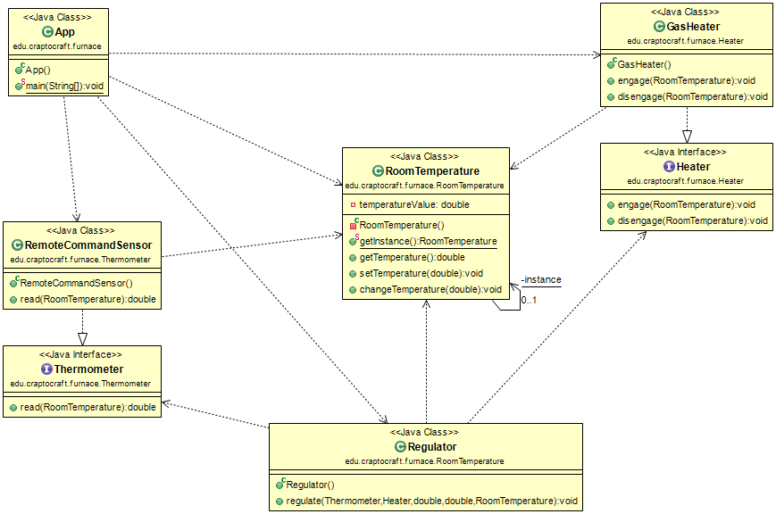
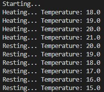

# Furnace Kata

**Table of contents**

-   [**Introduction**](#introduction)
-   [**UML Diagram**](#uml-diagram)
-   [**Application output**](#application-output)

## Introduction

This is a kata in Java proposed by our teacher with the purpose to practice the Singleton pattern and the Dependency Inversion Principle (DIP).

**Link of the kata:** [furnace-DIP-kata](https://github.com/dfleta/furnace-DIP-kata).  

## UML Diagram

   

## Application output

   
